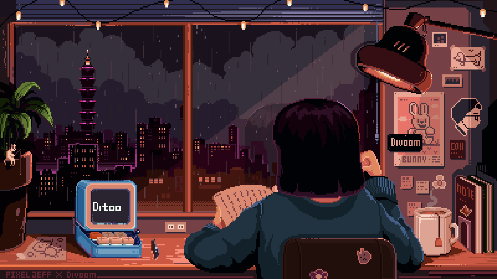

  

#

Atualmente sou estudante de Análise e Desenvolvimento de Sistemas (ADS) e apos termino, vou começar Sistema de Informação (SI) no Centro Universitário Fametro (Unifametro) e sou Full-stack Developer Intern.
  Me interesso tanto por Front-end e Back-end, estou desenvolvendo habilidades em Java, Spring Boot, Tests, Linux, SQLite, UX/UI e minhas principais linguagens são Java e JavaScript.
  Eu estudo, densenvolvo, programo e me atualizo na área da tecnologia constantemente, pois amo aprender e utilizar meus conhecimentos para criar soluções inovadoras!

#

<h3 align="left">Connect with me!</h3>

<h3 align="left">My Stack ~</h3>

  
  
  
  
  
  
  
  
  
  
  
  
  
  
  
  
  
   
  
  
    
  

  

#

  <h3>* GitHub Stats *</h3>
   
    
     
  </a>

     
#

<picture align="center">
  <source media="(prefers-color-scheme: dark)" srcset="https://raw.githubusercontent.com/CaioVidalDev/CaioVidalDev/output/github-contribution-grid-snake-dark.svg">
  <source media="(prefers-color-scheme: light)" srcset="https://raw.githubusercontent.com/CaioVidalDev/CaioVidalDev/output/github-contribution-grid-snake-dark.svg">
  
</picture>

#

  

